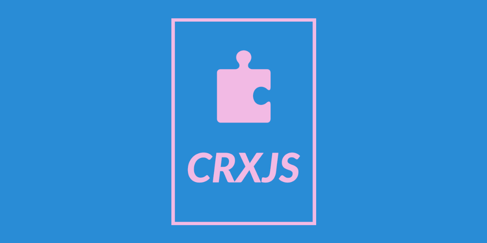

  
   
  
  <h3>Modern Chrome extension development with built-in HMR and zero-config setup</h3>
  
  [Homepage](https://crxjs.dev/vite-plugin) •
  [Getting Started](https://crxjs.netlify.app/guide/installation/create-crxjs) •
  [Discord](https://discord.com/invite/FnnE4XR7Wj)

